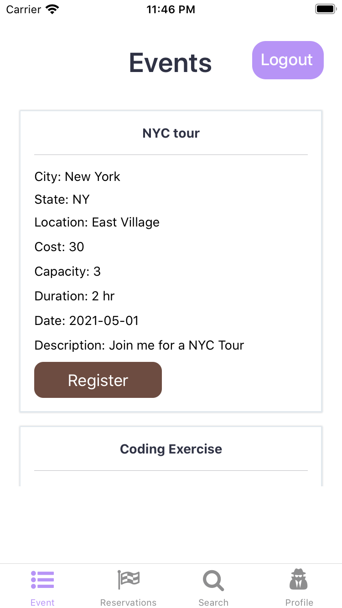

# meetME

#### Crystal Wang
##### 一亩三分账号： CrystalWang1225

## Description
The purpose of this project is to create a platform where users from 1point3acres can meet in person, create event, register for events that helps 1point3acres to stay organized and keep information easily accessible. The functionalities involve log in, sign up, check lists of events, register for desired events, check your own registered events, create evenets, and search for events. More funtionalities such as updating user profile, editing event details, or cancel reservations can be added if there is more time. This project is for 1point3acres intern position :)

## Interface
The event system is deployed on react-native as frontend, with python flask as backend api server along with SQLite as SQL database. The database can be populated by inserting new entries on the frontend React-native APP, or direrctly writing SQL. The user is able to log in with authentication, check for all available events, make reservations, or create their own events, view their profile infos, along with a search tab that searches events according to your query. React-native frontend app is developed using the help of [expo](https://expo.io/)

### Prerequisites
All the requirements for the system can installed by (in meetMe)
```
cd MeetMe2
npm install
cd backend
python3 -m venv env
sourc env/bin/activate
cd ..
pip install -r requirements.txt
```
### Running the program
The backend program can be run by 
```
python app.py
```
The frontend app can be run by
```
npm start
```

## ER Diagram
 <p align="center">
  
  </p>
  
  
## Functionalities & ScreenShots
* Login
 <p align="center">
  
  </p>
* Signup
 <p align="center">
  
  </p>
* Search Screen
 <p align="center">
  
  </p>
* Profile Screen
 <p align="center">
  
  </p>
* Event Screen
<p align="center">
  
  </p>
* My Reservation & Event 
 <p align="center">
  
  </p>
* Making new registration
 <p align="center">
  
  </p>
  * Making new event
 <p align="center">
  
  </p>
